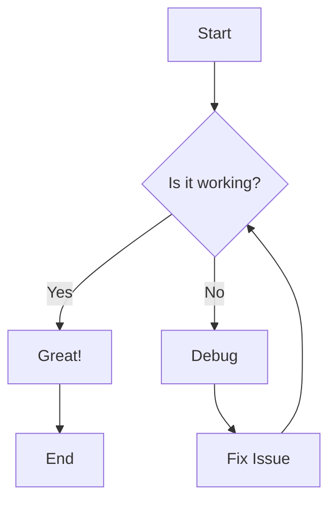
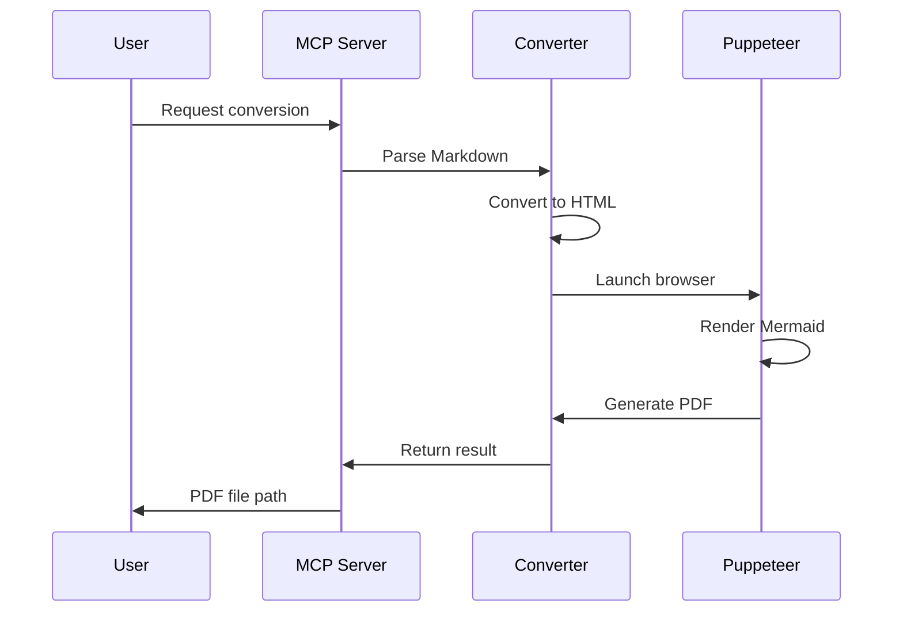
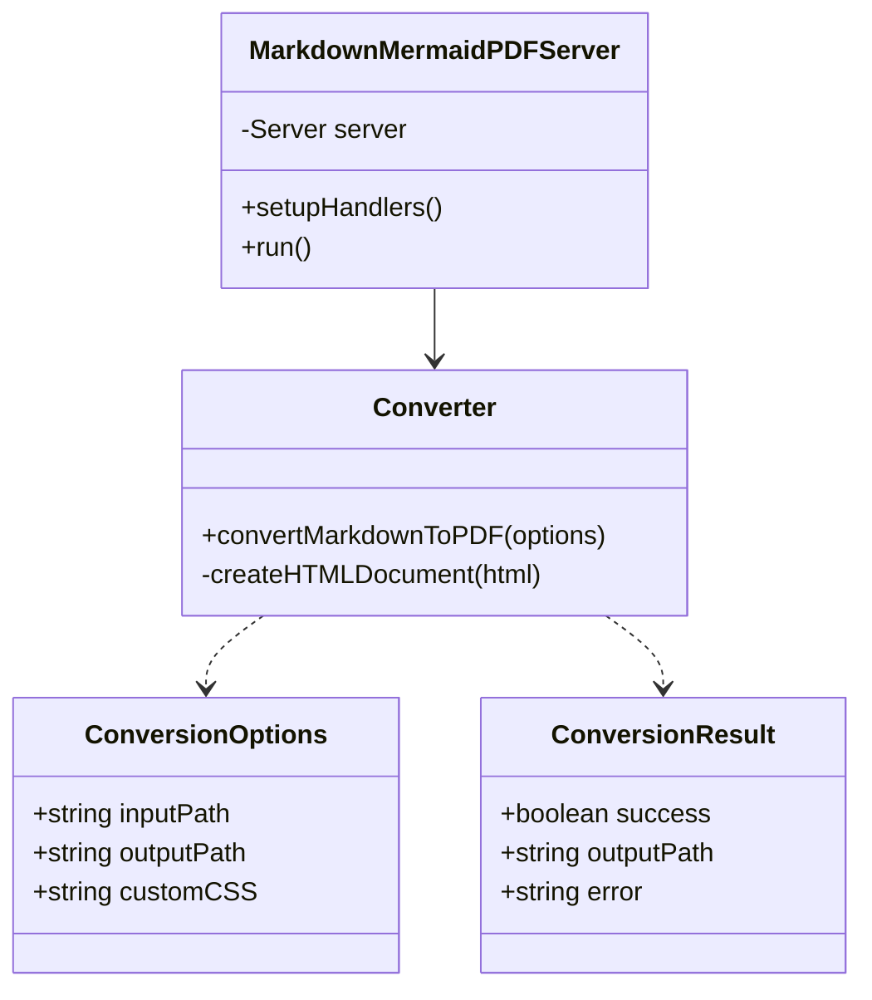
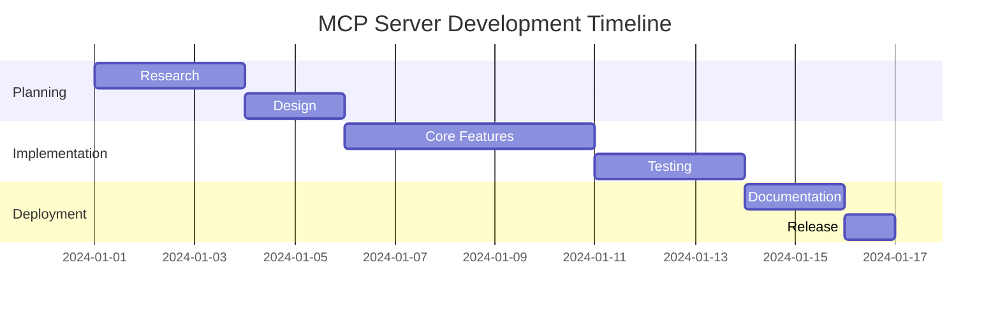

# Example Document: System Architecture

This is an example Markdown document that demonstrates the conversion of Markdown with Mermaid diagrams to PDF.

## Project Overview

This document showcases various types of Mermaid diagrams that can be embedded in Markdown and converted to PDF format.

## Flowchart Example

Below is a simple flowchart showing a decision process:



## Sequence Diagram

Here's a sequence diagram showing the interaction between components:



## Class Diagram

This class diagram shows the structure of our system:



## Gantt Chart

Project timeline:



## Conclusion

This example demonstrates how Markdown content with various types of Mermaid diagrams can be seamlessly converted to PDF format while maintaining visual quality and layout.

### Key Features

- **Clean Rendering**: All diagrams are rendered as high-quality SVG graphics
- **Professional Styling**: Default CSS provides a clean, readable layout
- **Flexibility**: Support for custom CSS styling
- **Easy Integration**: Simple MCP tool interface

### Code Example

Here's a simple code snippet to show code formatting:

```typescript
import { convertMarkdownToPDF } from './converter.js';

const result = await convertMarkdownToPDF({
  inputPath: '/path/to/document.md',
  outputPath: '/path/to/output.pdf'
});

console.log(result.success ? 'Done!' : result.error);
```

---

**Generated by Markdown + Mermaid to PDF MCP Server**
